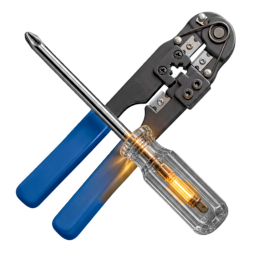

# Strument logo

By D. Bohdan, Claude Fable 5, GPT Image 2, and Nano Banana 2.

Generated by GPT Image 2 from a prompt written by Claude Fable 5.
Revised by Nano Banana 2.
Edited in GIMP to remove the green glow by D. Bohdan.

## Logo

## Draft prompt

> A retro Windows Vista-style icon showing a Philips-head screwdriver with a clear plastic handle and a crimping tool. The screwdriver and the crimping tool form an X. Transparent background.

Fable enhanced this prompt.

## GPT Image 2 prompt

> A Mac OS X Tiger-style application icon, photorealistic rendered 3D objects in orthographic three-quarter view with no perspective distortion, soft studio lighting, subtle soft shadow beneath, on a plain solid uniform green background with no texture.
>
> Two tools crossed in an X shape. In back: an HT-500 style modular plug crimping tool made from flat stamped steel plates, matte dark gunmetal, with a long straight rectangular head. Along the head are three rectangular die openings cut fully through the steel, so the green background is visible through each hole; the edges of each opening have small square crenellated notches like the contact end of a modular plug. Next to the openings, small engraved labels read "8P", "6P", "4P". The two handles are covered in blue rubber sleeves, connected to the head by a riveted compound lever linkage with visible round rivets.
>
> In front: a Phillips screwdriver with a polished chrome shaft and cross-point tip, and a transparent faceted acetate handle. Deep inside the clear handle glows a warm amber ember, like a small vacuum-tube filament, its light refracting softly through the plastic facets and casting a faint warm glow on the chrome shaft where it meets the handle. The glow is contained inside the handle, no sparkles or light rays outside it.
Clean icon composition, strong X silhouette, both tools fully inside the frame, no other objects, no text except the three engraved labels.

## Nano Banana 2 prompt

> Please keep the screwdriver with the glowing handle (it's very nice as it is) and redo the crimping tool in this logo. I want it to look like the attached HT-210, except with blue handles. Keep the screwdriver overlayed on top to the crimping tool as it is now. Make the background a solid green #00FF00 for easy extraction.
